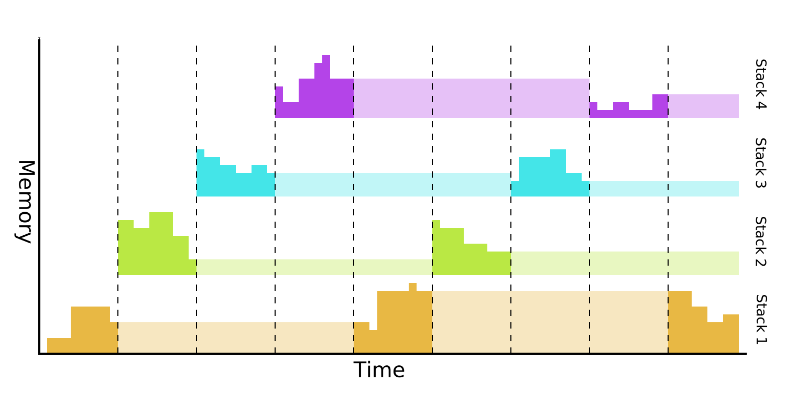
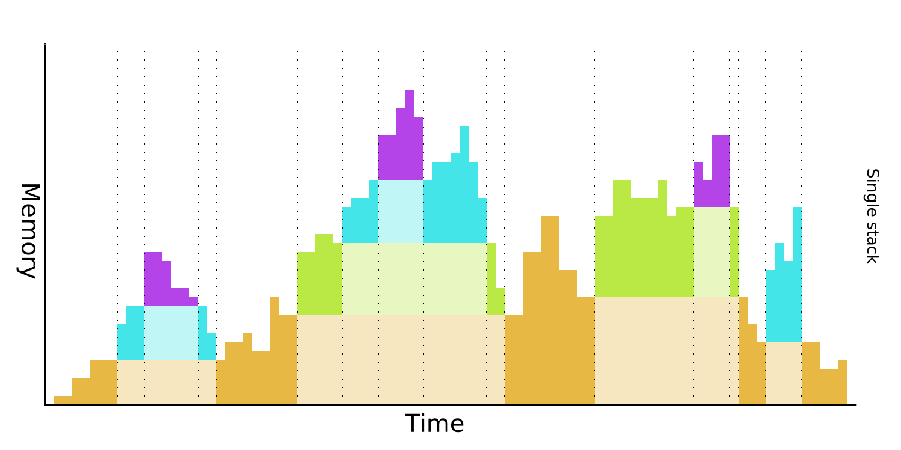
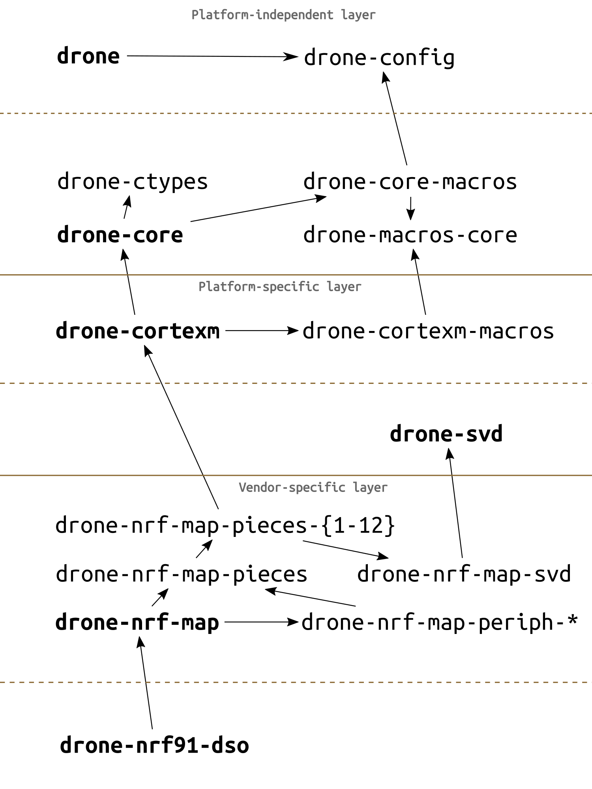

# Drone OS

Embedded OS for Real-time applications

<https://www.drone-os.com/>
<https://book.drone-os.com/>

- Design principles:
  - Interrupt-driven execution model
  - Hard Realtime: atomic operations instead of critical sections
  - Fully preemptive multi-tasking with strict priorities
  - Highly concurrent
  - message passing concurrency
  - single stack by default (stackful task still supported)
  - Dynamic memory enabled

- Crates:
  - drone-core: foundational crate; functions shared by all platforms
  - platform crates (cortexm, riscv)
  - vendor / peripheral mappings generated from SVD files (stm32-map, nfr-map)
- Restriction: architecture must support atomic compare-and-swap operations
- No assumption about platform it runs on
- Library OS; statically linked with its application
- Features:
  - async/await by default
  - stack is stack-overflow protected independent of MMU/MPU
  - zero-cost abstractions for memory-mapped registers
- Not supported:
  - loading dynamic applications
  - time-slicing
- Root task as entry point

### Concurrency

- Conventional: 

  - require MMU/MPU to protect from stack overflow

- Drone Single Stack: 
  
  - utilize nested vectored interrupt controller
  - strictly prioritized fully preemptive scheduling
  - task must completely relinquish stack before completing or pausing
  - stack placed at border of RAM -> protect from stack overflow
- Uses rust async/await or generator syntax -> translate to state machines
  - task state is stored on heap
- optional conventional stateful tasks
  - allocate separate stack
  - requires MMU/MPU, else unsafe

### Fibers

- Finite-state machines
- main building blocks for tasks
- platform-specific
- can yield multiple times until completion
```rs
pub trait Fiber {
    type Input;
    type Yield;
    type Return;

    fn resume(
        self: Pin<&mut Self>,
        input: Self::Input,
    ) -> FiberState<Self::Yield, Self::Return>;
}

pub enum FiberState<Y, R> {
    Yielded(Y),
    Complete(R),
}
```
- Processes: special kind of fibers (only if MPU/MMU present)
  - can be suspended with special blocking call
  - use dedicated dynamically allocated stacks
  - requires supervisos (?)
- Thread: sequence of fibers managed independently by an itnerrupt controller
  - corresponds to hardware interrupts
  - owns fiber chain (linked list of fibers), run in LIFO order
  - if fibers yields continue with next in chain
  - if fiber returns remove from chain
  - suspend when no fibers left
- Task: logical unit of work
  - represented as async function, running in separate thread
- Message-passing (inter-thread communication):
  - oneshot channel
  - ring channel: use fix-sized ring buffer
  - pulse: repeatedly notify other thread about some event; not payload (backed by atomic counter)
- futures: takes fiber, returns future; resolved on `fib::Complete`
  - platform-specific
- streams: takes fiber, returns stream; resolves on each `fib::Complete` or `fib::Yield` 
  - platform specific

### Dynamic Memory

- global allocator
  - deterministic
  - small code size
  - splits whole heap memoruy region into (configurable) fixed-sized memory pools


### Hardware abstraction

- Platform-specific layer:
  - Drivers
  - backend for threading API
  - `core::task::Waker` implementation
  - stackful fibers
- Vendor-specific layer
  - Complex API for access to Memory mapped registers
    - Generates MCU-specific APIs from SVD files
  - Peripheral mappings manually



