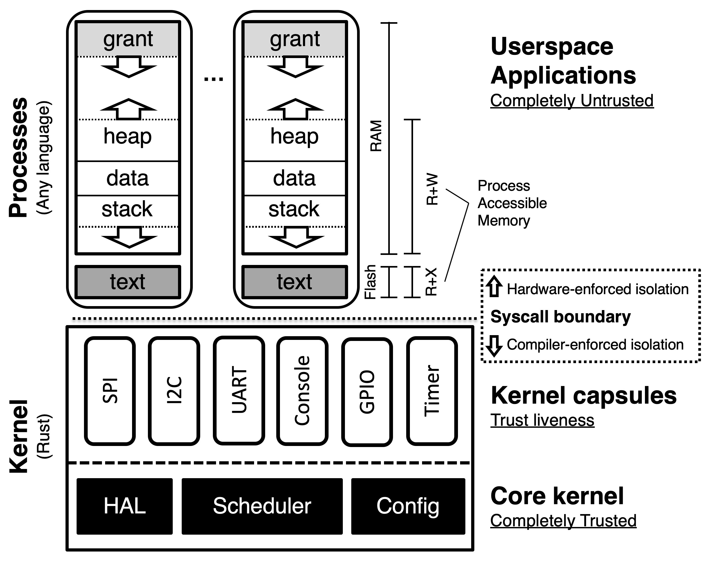

# Tock OS - Notes

- Secure OS for IoT
- Allows multiple untrusted application to run concurrently

## Paper: The case for writing a Kernel in Rust

source: https://www.tockos.org/assets/papers/rust-kernel-apsys2017.pdf 

- Challenge for writing kernel in Rust: Need for multiple mutable references
- Trusted Kernel Code:
  - Context Switches
  - Memory-mapped I/O and structures
  - Mamory allocator 
  - Userspace buffers
  - Interrupt/ exception handler
  - TakeCell
    - safely share complex structures in kernel
    - Like Cell, but without memory copies
    - Code is passed in through a closure
- Direct Memory Access:
  - kernel exposes memopry-mapped registers as typed data structures
  - statically allocated buffers & heap buffers
- Multiple reference to same data: use logical aliases

## Paper: Multiprogramming a 64 kB Computer Safely and Efficiently

source: https://www.tockos.org/assets/papers/tock-sosp2017.pdf

- Enable multiprogramming on embedded systems
- Problems with existing kernels:
  - Relies on hardware: processor-enforced privilege leves & MMU
  - Large amount of RAM needed for dynamix application requirements
  - Low-level OS often monolithic: use same memory for user apps & OS
- "Grants": portions of process memory to maintain state for process's requests to kernel services
  - Processes can not starve each other
- kernel uses static allocation

### Tock Architecture

- Stakeholders:
  - Board integrators
  - Kernel component developers
  - Application developers
  - End-users
- two classes of code: capsules & processes

#### Capsules

- Units of composition within the kernel
- instance of a Rust struct
- kernel schedules capsule cooperatively
- share a single stack
- Untrusted Capsules:
  - cannot subvert Rust type system
  - can only access ressources explicitly granted to it; only what is permitted through their interface
  - e.g. drivers, multiplexing hardware, sys-call capsules
- Truss ted Capsules: 
  - small number of capsules that interact directly with hardware
  - low-level abstractsion of MCU peripherals (cast memory ampped regs to type-safe structs)
  - core kernel capsules (e.g. process scheduler, that manipualtes CPU registers)
- Isolated through Rust type system
- Kernel scheduler: Event driven; events are generated from hardware interrupts or sys calls
- Capsules interact directly through fucntion calls or shared state variables
  - Can not generate events (thus does not go through event scheduler)
  - Statically allocated event queue since number of events is know at compile time
- Sandboxed by a type-system

#### Processes

- Processes are hardware-isolated concurrent executions of programms
- own locgical region of memory: stack + heap + static variables; independent of kernel & other processes
  - separate stacks allows kernel to schedule processes preemptively
- Round-robin schedule
- Difference compared to Linux:
  - only absolute addrs: no virtual memory, processes don't share code through shared libs 
  - sys-call API is non-blocking
- Advantages compared to Capsules:
  - HArdware isolated instead of sandboxed by type system -> can be written in any language
  - PReemptively schedules -> can safely execute long-running computations
- features:
  - can be loaded & replaced independently
  - concurrent
  - memory isolated enforced by hardware
  - no system resource exhaustion possible: isolated memory regions & preemptive scheduling
  - efficient use of memory
- processes can not run in parallel with kernel

#### System Call Interface

- Used by processes to interact with kernel
- Supported sys calls: 
  - **Command**: Invoke an operation on a capsule
    - requests to capsules with world-sized integer args
    - e.g. configure timers
  - **Allow**: Give memory for a capsule to use
    - pass more complicated data buffers to capsules
    - kernel verifies this memory & creates struct that checks that the process is alive before each usage
    - e.g. to receive network packages
  - **Subscribe**: Register an upcall
    - Callback structure created from fn-& user-data pointer
    - Capsule invokes call-back (scheduled in call-back queue)
    - e.g. request to be notified when network packet arrives
  - **Memop**: Increase heap size
    - Invokes core kernel
    - Moved memory break between heap & grant regions
  - **Yield**: Block until an upcall completes
    - Blocks process untill callback-queue is not empty

#### Grants

- Problem: processes dynamically allocate memory from heap. How can the kernel/ a capsule itself dynamically allocate memory?
- separated sections of kernel heap located in eahc process's memory space + API
- Grant interface allows capsules to access dynamically allocated memory on a per-process basys
- independent between processes; freed when process dies
- Created by capsule (conceptually), then `enter` to allocate/ use for a specific proccess
- `Owned` wraps memory reference for access
- Located within process's memory, but process can not acces it (enforced by MPU)
- Grants & process heap in shared allocation space
  - Process heap memory grows upward from bottom 
  - kernel-controlled grant memory grows downward from top
  - tracked in kernel process table
  - if they meet memory allocation will fail
  - (On cortex-M) <top>|grant-> <-heap|data|stack->|<bottom>||text
    -> stack overflow triggers MPU violation
- Alternative: Static allocation in TOSThreads
  - each multiplexed service is a statically-alllocated request queue
  - every client has single reserved entry in queue
  - no memory isolation

#### Overhead: 

- each cpasule needs references to dependencies
- can't run as Interrupt service rountine -> event-handler routing needs to be reimplemented
- significant overhead per-process: context-switching- & state-metadata: 164B (vs RIOT 14B)
- not optimized for many processes
- over-allocation for stacks to allow preemption
- Communication overhead for capsules only one word
- Communication between processes requries ctx switch
- Overhead for grants in kernel: 4B + 2 words

## Code / GitRepo

### docs

- 
- 

| Category               | Capsule     | Process        |
| ---------------------- | ----------- | -------------- |
| Protection             | Language    | Hardware       |
| Memory Overhead        | None        | Separate stack |
| Protection Granularity | Fine        | Coarse         |
| Concurrency            | Cooperative | Preemptive     |
| Update at Runtime      | No          | Yes            |

Hardware Interface Layers: 
- Portable collection of traits; interface between the following layers:
1. Chips-specific drivers
  - hardware specific impleemntations
  - ideally implement common HIL
2. chip-agnostic drivers & subsystems 
  - live in capsules crate
  - rely on chip-specific drivers through HILs
3. system call drivers 
  - live in capsules crate
  - implement part of system call interface
  - more abstracted than 2.
- One HIL for one service / abstraction
- All I/O-Operations in Tock are non-blocking
  - Writing drivers is more complicated
    -> favor kernel safety over driver simplicity

## HAL

kernel crates:
- kernel/: kernel oeprations & library; Hardware Interface Layer (HIL) definitions
- arch/ folder: Architecture crate; currently support ARM Cortex-M0, Cortex-M3, and Cortex M4, and the riscv32imac architectures; porting to another ARM Cortex M should be easy, for other architectures more work. 
  - Syscall entry/exit
  - Interrupt configuration
  - Top-half interrupt handlers
  - MPU configuration (if appropriate)
  - Power management configuration (if appropriate)
- chips/ Chip-specific crate:  handle interrupts, implements hardware abstraction layer for chip's perihperals; implement HIL defined by kernel
  - separate crate for shared code between same family of microcontrollers
  - use svd for setting up register mapping for invidual peripherals
- capsules/ hardware independent drivers & visualization layers
- boards/ platofrm specific crate: configure kernel; configure chip & peripherals, assigns peripherals to drivers, sets up virtualization layers, defines system call itnerface
  - leverage "components" for capsules: structs that inlcude all setup code for a driver; only require board-specific options to be passed -> alternative to verbose driver instantiation

### Binary format:

- Tock loads application separately form kernel
-`.apps section`: placeholder in kernel; at physical address where the applications will be loaded
  - applications must follow Tock Binary Format

## Porting Tock to a new Platform

- Platform requirements: 
  - memory protection Unit
  - 32-bit (with hacks also on 64-bit)
  - at least 64kB RAM, 128kB flash 
  - one single core (multicore is okay, but only one used by tock)

